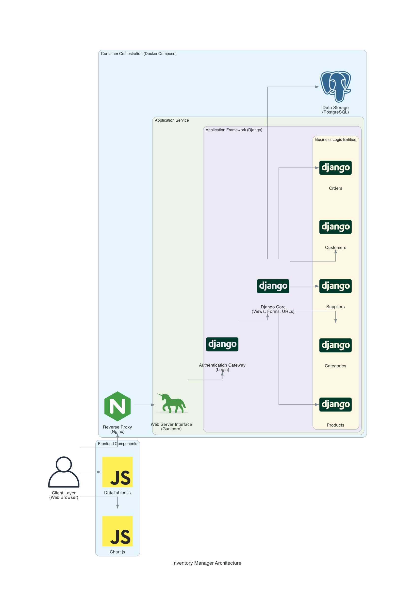

# Inventory Management System

## Overview
This project is an Inventory Management System designed to help small businesses manage their products, suppliers, orders, and customers efficiently. It is built using Django for the backend and a combination of HTML, CSS (Bootstrap), and JavaScript (with Chart.js and DataTables.js) for the frontend. The application allows authenticated users to perform CRUD (Create, Read, Update, Delete) operations on inventory data, and generate various insightful reports and charts, providing a robust and interactive interface. [Watch a demo here.](https://www.youtube.com/watch?v=YwB0Oorlses)

## Architecture



## Distinctiveness and Complexity

### Distinctiveness
- **Unique Features**: Unlike a standard Django CRUD application, this project incorporates more advanced features such as real-time data validation, AJAX-based updates, dynamic inventory management, and various types of charts and reports that visualize sales data. This makes it distinct from simple to-do list applications or other basic projects.
- **Custom Business Logic**: The system handles complex business logic for managing inventory quantities, order creation, editing, and cancellation. For instance, when an order is placed, the stock is adjusted accordingly. This requires careful handling of database transactions and consistency, which adds to the project's distinctiveness.

### Complexity
- **Complex Data Models**: The project has a well-defined data model structure involving multiple relationships, including one-to-many (e.g., a supplier can have multiple products) and many-to-many relationships (e.g., orders and products via OrderItems). These relationships require advanced querying and data manipulation.
- **AJAX and Dynamic Updates**: The use of AJAX for updating order details without refreshing the page demonstrates the complexity of handling asynchronous operations and integrating them into a Django project.
- **Advanced Table Management with DataTables.js**: The project integrates DataTables.js to enhance table functionality, with buttons to export data as CSV, Excel, PDF, print, or copy it to the clipboard. This adds complexity through dynamic table features and advanced exporting options.
- **Advanced Data Visualization**: The implementation of multiple charts (line, bar, and pie charts) using Chart.js adds complexity, as it requires data aggregation and real-time processing of data from the backend to provide insights into the business's performance.
- **Form Handling and Validation**: The project implements complex form handling, with custom validations on forms such as ensuring stock levels remain accurate when editing or creating orders.

Overall, this project goes beyond a simple CRUD application by incorporating advanced features, making it a comprehensive and distinct system suitable for inventory management.

## File Structure

This project follows a standard Django file structure. The main application logic resides in the `inventorymanager` app, which contains essential files such as `models.py` for defining database models, `views.py` for handling request logic, `urls.py` for routing, `forms.py` for handling form validation, and `admin.py` for Django admin configurations. Database migrations are stored in the `migrations` folder, which includes automatically generated migration files. The HTML templates are located within the `templates/inventorymanager` directory, where individual pages such as `orders.html`, `customers.html`, and `index.html` are stored.

Static assets are placed in the `inventory_system/static/inventorymanager/` folder. This includes `styles.css` for custom styling, JavaScript files for DataTables.js, Chart.js visualizations, and any other front-end logic. The `js` folder houses files for initializing DataTables and charts. The `requirements.txt` file lists all the necessary dependencies for the project, including `django-crispy-forms`, and there is a file with sample data saved as `sample_data.json`.

The `venv` directory contains the virtual environment for the project, which isolates the dependencies needed for the app. Lastly, the `manage.py` file is the entry point for running the application and handling administrative tasks like migrations and starting the server.

## How to Run the Application

### Prerequisites
- Python 3.x installed on your machine
- Django 4.x installed
- A virtual environment (recommended)

### Installation

1. **Clone the Repository**:
    ```
    git clone https://github.com/Vbabino/inventory_management.git
    cd inventory_management
    ```

2. **Set Up a Virtual Environment**:
    ```
    python3 -m venv venv
    source venv/bin/activate  # On Windows: venv\Scripts\activate
    ```

3. **Install Required Packages**:
    ```
    pip install -r requirements.txt
    ```

4. **Set Up the Database**:
    ```
    python manage.py makemigrations
    python manage.py migrate
    ```

5. **Load Sample Data**:
    ```
    python manage.py loaddata sample_data.json
    ```

6. **Create a Superuser** (Admin):
    ```
    python manage.py createsuperuser
    ```

7. **Run the Development Server**:
    ```
    python manage.py runserver
    ```
    Visit `http://127.0.0.1:8000` in your browser to access the application.

### Using the Application
- Log in as an admin with the superuser account you created.
- You can then add, edit, delete, and view products, suppliers, customers, and orders through the UI.
- View the dashboard for insights such as sales revenue over time, top-selling products, and supplier contributions.

### Future Improvements
- Integrate Django Channels for real-time updates and notifications.
- Add more advanced reporting and analytics.
- Implement user role-based access for better permissions control.

### Acknowledgements
- [SB Admin Template](https://startbootstrap.com/template/sb-admin) - Start Bootstrap: Bootstrap themes, templates, and UI tools.
- [CS50W](https://cs50.harvard.edu/web/2020/) - CS50’s Web Programming with Python and JavaScript. 

### About Me
https://github.com/Vbabino/Vbabino/blob/main/README.md